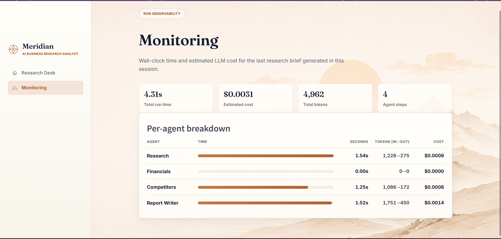

<div align="center">

[](https://git.io/typing-svg)

[](https://python.org)
[](https://streamlit.io)
[](https://github.com/langchain-ai/langgraph)
[](https://groq.com)
[](https://www.trychroma.com)
[](#-license)

> **Give it a company name. Get back a cited research brief — recent news, financial snapshot, and competitive landscape — in seconds, not hours.**
> **+ a live Monitoring page tracking wall-clock time and LLM cost for every agent, every run.**

| 🕸️ Orchestration | ⚡ LLM | 🔎 Search | 📈 Financial Data | 📚 RAG | 📊 Monitoring |
|:-----------------:|:------:|:---------:|:------------------:|:------:|:--------------:|
| **LangGraph** | **Groq · Llama 3.3 70B** | **Tavily** | **yfinance (live)** | **ChromaDB + sentence-transformers** | **Time + cost per agent** |

<!-- Uncomment once the Live App link is confirmed working:
**[🚀 Try the Live App →](https://meridian-com.streamlit.app)**
-->

</div>

---

## ✦ App Preview

### 🖥️ Research Desk
<p align="center">
  
</p>

### 📊 Monitoring — Time & Cost per Agent
<p align="center">
  
</p>

*(Add your screenshots to `assets/screenshots/` in the repo, then update the two paths above to match your actual filenames.)*

---

## ✦ What is This?

Investment, consulting, and procurement teams routinely need a fast first pass on a company before a call, a deal, or a pitch — normally that means a junior analyst spending an afternoon stitching together news, financials, and competitor context.

**Meridian automates that first pass.** Give it a company name (and optionally a ticker), and three specialized agents research it in parallel-ready fashion: recent news and strategy, live financial metrics, and the competitive landscape. Everything they find is embedded into a local vector store, so the final Report Writer agent doesn't just summarize — it *retrieves* the most relevant evidence for each section before writing, keeping the report grounded in real, citable sources instead of the model's own memory.

A built-in **Monitoring page** makes the pipeline's cost and latency visible instead of a black box: exactly how long each agent took, how many tokens it used, and what that run cost in USD.

---

## ✦ Project Structure

```
meridian/
├── app.py                       ← Streamlit UI (Research Desk + Monitoring pages)
├── config.py                    ← API keys, model settings, paths, Groq pricing
├── requirements.txt
├── runtime.txt                  ← Python runtime version for deployment
├── .env.example
│
├── src/
│   ├── state.py                    ← Shared LangGraph state (incl. timings/cost fields)
│   ├── graph.py                    ← Builds and runs the LangGraph pipeline
│   ├── agents/
│   │   ├── research_agent.py          ← Recent news & strategy (Tavily)
│   │   ├── financial_agent.py         ← Live financial snapshot (yfinance)
│   │   ├── competitor_agent.py        ← Competitive landscape (Tavily)
│   │   └── report_writer_agent.py     ← RAG retrieval + final cited report
│   ├── tools/
│   │   ├── web_search_tool.py         ← Tavily wrapper
│   │   └── financial_tool.py          ← yfinance wrapper
│   ├── rag/
│   │   └── vector_store.py            ← Chroma wrapper (embed / store / retrieve)
│   └── utils/
│       ├── llm_client.py              ← Shared Groq client builder
│       ├── monitoring.py              ← Per-agent time + token/cost tracking
│       └── export.py                  ← Markdown / PDF export
│
├── data/                         ← [Describe what this holds, e.g. sample/cache data]
│
└── assets/
    ├── style.css                 ← Brand stylesheet (paper/copper/sage palette)
    ├── back.png                  ← Site background image
    └── screenshots/               ← App preview images used in this README
```

---

## ✦ How the Pipeline Works

| Step | What Happens |
|:-----|:-------------|
| **1. Research** | Searches recent news, announcements, and strategic moves via Tavily; embeds every snippet into the session's vector store |
| **2. Financials** | Pulls live market data via `yfinance` if a ticker is provided — degrades gracefully if not |
| **3. Competitors** | Searches for market positioning and rivals; runs independently, never blocked by a missing ticker |
| **4. Report Writer** | Queries the vector store per section (news / financial / competitor), retrieves the most relevant grounded evidence, and writes the final cited Markdown report |
| **5. Monitor** | Every LLM call and every node's wall-clock time is logged onto the run's state as it happens |

Research, Financials, and Competitors only depend on the original company name/ticker — not on each other — so the graph is structured to make parallelizing them a small change (see Roadmap).

---

## ✦ Tools & RAG

| Component | Purpose |
|:----------|:--------|
| `WebSearchTool` (Tavily) | Clean, LLM-ready web snippets for news & competitor research |
| `FinancialDataTool` (yfinance) | Live price, market cap, P/E, margins, growth — no paid key needed |
| `ResearchVectorStore` (ChromaDB) | Fresh collection per company; local `sentence-transformers` embeddings, no API key, works even if Groq/Tavily quotas run out |
| Report Writer retrieval | Semantic search over everything the earlier agents collected, so the final report cites real retrieved evidence instead of the model's memory |

---

## ✦ Monitoring — Time & Cost, Per Agent

Every run tracks two things per node (`research` / `financials` / `competitors` / `report_writer`):

- **Wall-clock time** — where the run is actually spending its seconds
- **Token usage + estimated USD cost** — pulled from the LLM response's usage metadata, priced against `config.py`'s per-model Groq rates

| Metric | Where it shows |
|:-------|:----------------|
| Total run time & total cost | Top summary cards on the Monitoring page |
| Per-agent time (with progress bar) | Breakdown table |
| Per-agent tokens (in → out) | Breakdown table |
| Per-agent estimated cost | Breakdown table |

Nothing is persisted between sessions — it reflects the most recent run in the current browser session. No external tracing service or extra API key required.

---

## ✦ Tech Stack

| Layer | Technology |
|:------|:-----------|
| 🐍 Language | Python 3.10+ |
| 🕸️ Orchestration | LangGraph (state graph, one node per agent) |
| ⚡ LLM | Groq — `llama-3.3-70b-versatile` |
| 🔎 Web search | Tavily |
| 📈 Financial data | yfinance |
| 📚 RAG / Vector DB | ChromaDB + `sentence-transformers` (local, offline) |
| 🎛️ UI | Streamlit, custom stylesheet, no default Streamlit look |
| 📊 Monitoring | Custom lightweight time + cost tracker (no external service) |
| 📄 Export | Markdown / PDF |

---

## ✦ Quick Start

```bash
# 1. Clone the repo
git clone https://github.com/morad-elnahla/Meridian.git
cd Meridian

# 2. Create a virtual environment
python -m venv venv
source venv/bin/activate      # Windows: venv\Scripts\activate

# 3. Install dependencies
pip install -r requirements.txt

# 4. Add your API keys
cp .env.example .env
```

Then open `.env` and fill in:

| Key | Where to get it | Free tier? |
|:----|:-----------------|:----------:|
| `GROQ_API_KEY` | <https://console.groq.com> | ✅ |
| `TAVILY_API_KEY` | <https://tavily.com> | ✅ |

```bash
# 5. Run
streamlit run app.py
```

App opens at `http://localhost:8501`.

---

## ✦ Deploy to Streamlit Cloud

```
1. Push the repo to GitHub
2. Go to share.streamlit.io
3. Connect the repo → main file: app.py → Deploy
4. In app Settings → Secrets, add GROQ_API_KEY and TAVILY_API_KEY
```

Note: Streamlit Community Cloud's filesystem is ephemeral, so the vector store resets on redeploy/sleep — by design, since each analysis creates a fresh collection anyway.

---

## ✦ Design Notes

- **Sequential graph, parallel-ready.** Research / Financial / Competitor agents don't depend on each other's output — only on the original input. The graph runs them sequentially today for clearer live progress in the UI; the structure makes branching them in parallel a small change.
- **Graceful degradation.** A missing ticker or a rate-limited API doesn't crash the run — gaps are surfaced in the report instead of hidden.
- **Fresh vector store per session.** Each analysis creates its own Chroma collection so results from different companies never mix.
- **Cost estimates, not billed usage.** Monitoring numbers are computed from token counts × the rates in `config.py` — update those rates if Groq's pricing changes.

---

## ✦ Roadmap

- [ ] Parallelize the Research / Financial / Competitor agents
- [ ] Retry/backoff on Tavily and Groq rate limits instead of failing silently
- [ ] Faithfulness check — verify report claims against retrieved evidence before returning it
- [ ] Structured (Pydantic) agent outputs instead of free-text summaries
- [ ] Multi-company comparison reports
- [ ] Persistent report history across sessions
- [ ] Configurable LLM provider (OpenAI / Anthropic as alternatives to Groq)

---

## ✦ Troubleshooting

| Problem | Likely cause | Fix |
|:--------|:--------------|:----|
| `GROQ_API_KEY not found` | `.env` missing or not filled in | Run `cp .env.example .env` and add your key |
| Empty / partial financial section | Invalid or missing ticker | Double-check the ticker symbol on Yahoo Finance |
| Report has few citations | Tavily rate limit hit | Wait a minute and re-run, or check your Tavily usage dashboard |
| Monitoring page shows 0 tokens | LLM response usage field not recognized | Check the response object shape against `src/utils/monitoring.py`'s `_extract_usage` |
| `ModuleNotFoundError` on launch | Virtual env not activated | Re-run `source venv/bin/activate` before `streamlit run app.py` |

---

## ✦ License

MIT — see `LICENSE` for details.

---

<div align="center">

Built by **[Morad Elnahla](https://github.com/morad-elnahla)**

*Meridian — ياخد اسم شركة، ويرجّعلك بحث موثّق في ثواني، مش ساعات.*

</div>
